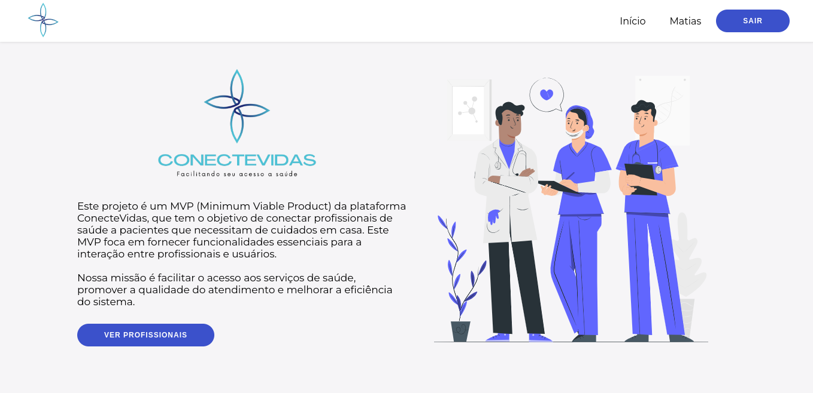

  

## Descrição

Este projeto é um MVP (Minimum Viable Product) da plataforma ConecteVidas, que tem o objetivo de conectar profissionais de saúde a pacientes que necessitam de cuidados em casa. Este MVP foca em fornecer funcionalidades essenciais para a interação entre profissionais e usuários.

## :technologist: Membros da Equipe

- Alliquison Matias da Silva, 508445

## 🔴 Clique na imagem para ver o vídeo do projeto:

## 👥 Papéis ou Tipos de Usuário da Aplicação

- **Usuário não logado**: Pode entrar na home e visualizar as variedades de profissionais na plataforma, mas ao clicar no perfil do profissional para visualizar, terá que fazer login ou cadastro.
- **Usuário Profissional**: Pode criar e gerenciar seu perfil, receber avaliações de pacientes e listar seus serviços.
- **Usuário Paciente**: Pode criar uma conta, procurar por profisisonais, acessar os perfis, solicitar um atendimento, avaliar os profissionais de saúde, ver os diferentes tipos de serviços ofertados.

## :triangular_flag_on_post: Principais Funcionalidades da Aplicação

- **Autenticação e Contas**:
  - Cadastro e login de usuários (Profissionais e Pacientes).

- **Perfil do Profissional**:
  - Criação e gerenciamento de perfil.

- **Visualização de Profissionais na home**:
  - Usuários podem visualizar perfis de profissionais de saúde na tela home.

- **Visualização dos serviços dos Profissionais**:
  - Usuários podem visualizar os serviços dos profissionais de saúde individualmente.

- **Avaliações de Profissionais**:
  - Usuários pacientes podem avaliar profissionais, deixando comentários e classificando com estrelas após concluir o atendimento.
 
- **Atendimentos entre Pacientes e Profissionais**:
  - Usuários podem enviar convites de atendimento para profissionais, que podem aceitar ou recusar.
  - Após a conclusão do atendimento, ambos podem registrar o atendimento como concluído.

## :desktop_computer: Tecnologias e Frameworks Utilizados

**Frontend:**
- Vue.js v3.0
- Vue Router
- Pinia
- Axios
- TypeScript
- HTML
- CSS

**Backend:**
- Strapi

## :shipit: Operações Implementadas para Cada Entidade da Aplicação

| Entidade            | Criação | Leitura | Atualização | Remoção |
| ------------------- | ------- | ------- | ----------- | ------- |
| Usuário             |    X    |    X    |      X      |         |
| Atendimento         |    X    |    X    |             |         |
| Serviço             |    X    |    X    |      X      |    X    |

## :neckbeard: Rotas da API REST Utilizadas

| Método HTTP | URL |
| --- | --- |
| POST | /auth/local |
| GET | /users/me |
| GET | /api/users |
| GET | /api/users/{id} |
| GET | /api/users?filters[profissional][$eq]=true |
| POST | /api/users/{id} |
| DELETE | /api/users/{id} |

## 🤔 Padrões de commit:

| tipo de commit   | palavra-chave |
| ---------------- | :-----------: |
| commit inicial   |     init      |
| novo recurso     |     feat      |
| correção de bugs |      fix      |
| refatoração      |     refac     |
